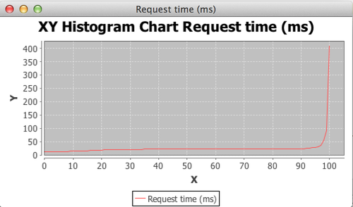

java-throughput-test-runner
===========================

Measures throughput of Java service called from many threads concurrently. It is designed for asynchronous services returning [rxJava](https://rx.codeplex.com/) observables, but also can be used for synchronous services (see example).
It generates statistics, histogram, histogram image.
 
It is built with:
- Java 8, 
- [Maven](http://maven.apache.org/), 
- [rxJava](https://rx.codeplex.com/),
- [JFreeChart](http://www.jfree.org/jfreechart/),
- [Hist4J](https://github.com/flaptor/hist4j) (embedded sources).

#### Configuration options 

- **action** *[Supplier\<Observable\<?\>\>](http://download.java.net/lambda/b78/docs/api/java/util/function/Supplier.html)* action to be tested. Execution time will be tested. Execution is measured from [subscription](https://github.com/ReactiveX/RxJava/wiki/Observable-Utility-Operators#doonsubscribe) to [completion](https://github.com/ReactiveX/RxJava/wiki/Observable-Utility-Operators#dooncompleted).
- **threads** number of threads *action* will be executed simultaneously.
- **testTimeInSeconds** total time test will be run.
- **histogram** should generate histogram? (See example report). 
- **histogramGraph** should generate histogram graph? (See example report). 
- **printer** method to log reports to output. Default [log4j](http://logging.apache.org/log4j/2.x/)

#### Computed Statistics

- **request rate** how many request per second service responds.
- **error rate** how many errors per second application returns. See [rxJava error handling](https://github.com/ReactiveX/RxJava/wiki/Error-Handling-Operators).    
- **max exec time** maximum registered single execution time in ms. 
- **avg exec time** average registered execution time in ms.  

How to start
-----------

#### Install in local repository.

```sh
mvn install
```

#### Add maven dependency.

```xml
	<dependency>
		<groupId>org.marekasf</groupId>
		<artifactId>java-throughput-test-runner</artifactId>
		<version>0.0.1</version>
		<scope>test</scope>
	</dependency>
```

#### Write test.

```java
	@Test
	public void throughputTest() 
	{
		ThroughputRunner.Builder.create()
				.action(() -> Observable.just(methodUnderThroughputTest()))
				.threads(8)
				.testTimeInSeconds(30)
				.printer(ThroughputRunner.SYSOUT)
				.graph(true)
				.histogram(true)
				.run();
	}
```

Run test and check report.
-----------

#### Example report.

```
REQUESTS: 23210, ERRORS: 2997751, TOTAL_EXEC_TIME_MS: 544789, TOTAL_LOOP_TIME_MS: 240763, LOOPS: 2979270
  request rate  : 773.7333333333333 r/s
  error rate    : 99925.03333333334 e/s
  max exec time : 408 ms
  avg exec time : 23.47216716932357 ms
  avg loop time : 0.07969738146585612 ms
  thread rate   : 42.6036502205441 r/s
  effective req : 1.2922679302175317 ms

Main percentiles (action execution time):
   5%: 12.672202 ms
  25%: 20.830631 ms
  50%: 21.999811 ms
  75%: 22.999472 ms
  80%: 23.000294 ms
  85%: 23.076073 ms
  90%: 24.017132 ms
  95%: 28.263609 ms
  99%: 91.21277 ms
```

#### Example histogram image.

